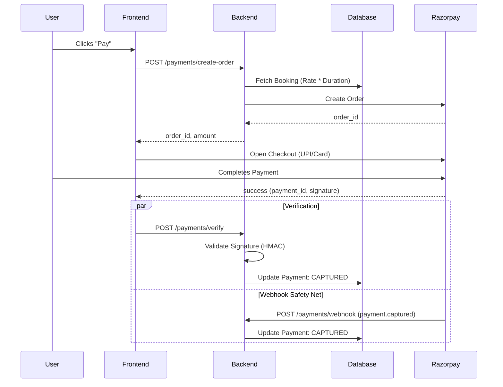

# Payment System Documentation (Razorpay Integration)

## 1. Overview

The CareConnect Payment System is built on a **Webhook-First Architecture** using **Razorpay**. It is designed to handle Indian payment methods (UPI, Cards, Netbanking) with high reliability, addressing common edge cases like network failures ("Ghost Deductions") and security threats.

## 2. Architecture

### The "Order-First" Flow

1.  **Order Creation (Server-Side)**: The frontend cannot determine the price. It requests an order from the backend. The backend calculates `Amount = Rate * Hours` and creates a Razorpay Order.
2.  **Payment (Client-Side)**: The user pays using the `order_id` via the Razorpay SDK.
3.  **Verification (Dual-Layer)**:
    - **Synchronous**: The frontend sends the signature to the backend for immediate verification.
    - **Asynchronous (Webhooks)**: Razorpay's server notifies our backend of the status. _This is the single source of truth._



## 3. Database Schema

We use a robust schema (`payments`) that links `bookings` to transactions.

| Field        | Type    | Description                                                               |
| :----------- | :------ | :------------------------------------------------------------------------ |
| `id`         | UUID    | Internal ID                                                               |
| `booking_id` | UUID    | Linked service booking                                                    |
| `amount`     | Decimal | Amount in INR (stored as actual value, backend converts to paise for API) |
| `provider`   | String  | `razorpay`                                                                |
| `order_id`   | String  | Unique Razorpay Order ID (`order_...`)                                    |
| `payment_id` | String  | Unique Razorpay Payment ID (`pay_...`)                                    |
| `status`     | String  | `created` -> `authorized` -> `captured` -> `failed`                       |
| `signature`  | String  | Cryptographic proof of payment                                            |

## 4. API Reference

### 1. Create Order

**POST** `/payments/create-order`
Generates a secure order ID for the frontend to use.

- **Body**: `{ "bookingId": "uuid" }`
- **Response**:
  ```json
  {
    "orderId": "order_LN123...",
    "amount": 500.0,
    "currency": "INR",
    "key": "rzp_test_..."
  }
  ```

### 2. Verify Payment

**POST** `/payments/verify`
Validates the success callback from the frontend.

- **Body**:
  ```json
  {
    "razorpay_order_id": "order_...",
    "razorpay_payment_id": "pay_...",
    "razorpay_signature": "hmac_sha256_hash"
  }
  ```
- **Response**: `{ "success": true }`

### 3. Webhook (Internal)

**POST** `/payments/webhook`
Receives events from Razorpay.

- **Headers**: `x-razorpay-signature`
- **Events Handled**: `payment.captured`, `order.paid`, `payment.failed`

## 5. Security & Edge Cases

### A. Amount Tampering

- **Protection**: Users cannot send an arbitrary amount. The backend calculates it based on the `booking_id`.

### B. "Ghost Deductions" (Money Cut, App Closed)

- **Protection**: Even if the user closes the app immediately after paying, the **Webhook** will arrive at our server and mark the booking as `COMPLETED`.

### C. Signature Spoofing

- **Protection**: All verification requests are checked against `HMAC_SHA256(order_id + "|" + payment_id, secret)`. If the hash doesn't match, the request is rejected with `400 Bad Request`.

## 6. Setup Guide

1.  **Environment Variables**:
    Add these to your `.env` file:

    ```bash
    RAZORPAY_KEY_ID=rzp_test_YOUR_ID
    RAZORPAY_KEY_SECRET=YOUR_SECRET
    RAZORPAY_WEBHOOK_SECRET=YOUR_WEBHOOK_SECRET
    ```

2.  **Testing**:
    - Use Razorpay's **Test Mode**.
    - Use the "Success" UPI ID (`success@razorpay`) to simulate a successful payment.
    - Use "Failure" UPI ID (`failure@razorpay`) to test error handling.
